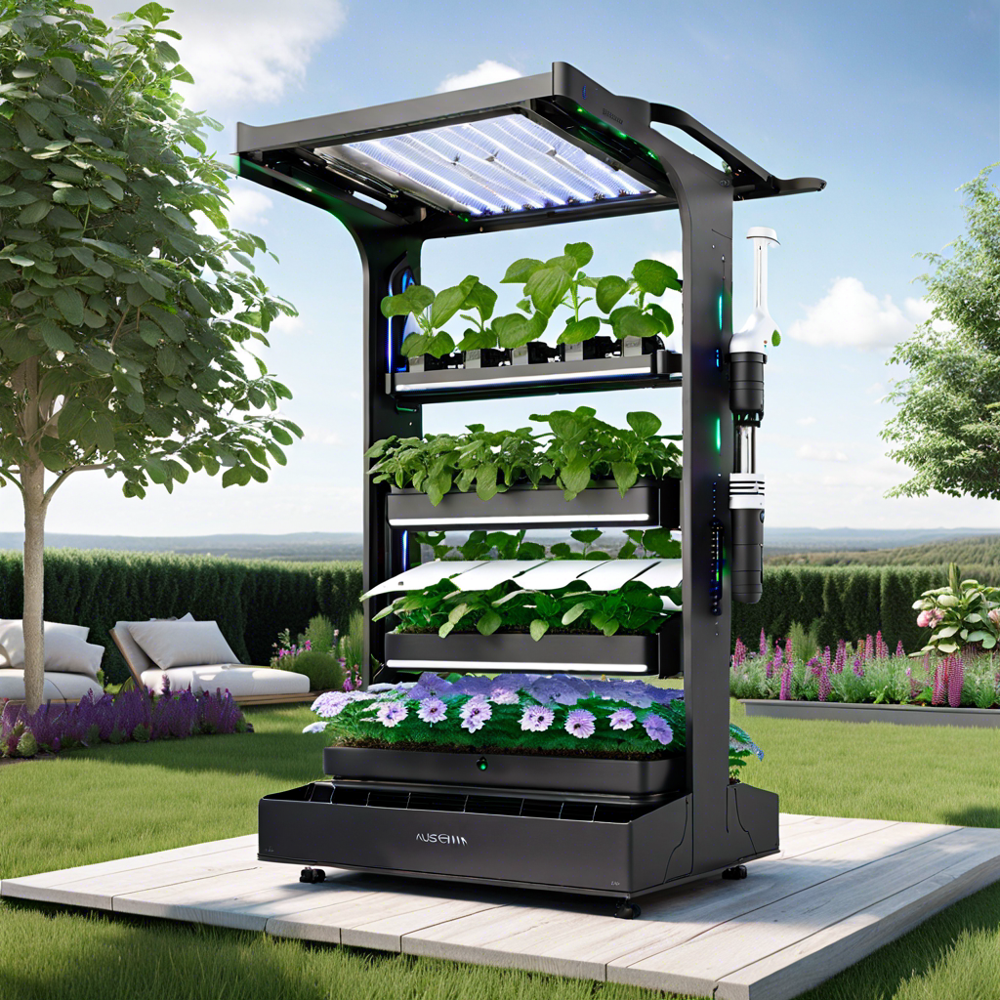

### EasyHydro&copy; Gardening Solution

Hydroponics gardening, a soil-less method of cultivating plants, has sparked a wave of interest among gardening enthusiasts, offering an innovative approach to growing crops in limited spaces. Our project centers on catering to hobbyists and small-scale gardening ventures, providing a user-friendly platform tailored to their needs. We crafted a comprehensive system designed to simplify the management of trays, slots, and plant growth in tiny hydroponic setups. With a keen focus on user experience, our solution offers intuitive interfaces and practical tools to facilitate every stage of the gardening journey. From monitoring plant progress to optimizing nutrient delivery, our platform empowers users to nurture their green spaces with confidence. By incorporating features such as real-time data visualization and automated notifications, we aim to enhance the gardening experience and foster a sense of connection with nature. Through ongoing refinement and feedback-driven iterations, we are committed to delivering a reliable and accessible solution that empowers hobbyists to explore the exciting world of hydroponic gardening.

  

**Integrated Automated Gardening System**

**EasyHydro&copy;** is an Integrated Automated Gardening System, a comprehensive solution designed to revolutionize home gardening. It combines innovative hardware, software, and management systems to create an autonomous gardening experience. With a focus on hobbyists and small-scale systems, the system integrates IoT devices and advanced software algorithms to optimize plant growth. From nutrient delivery to watering management, it leverages available energy and weather conditions to ensure optimal plant health. Powered by cutting-edge technology, this system offers a seamless gardening experience for enthusiasts of all levels.

**EasyHydro&copy;** is being developed with the help of ChatGPT and DALL E.
